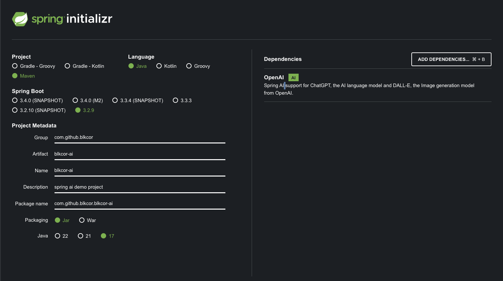
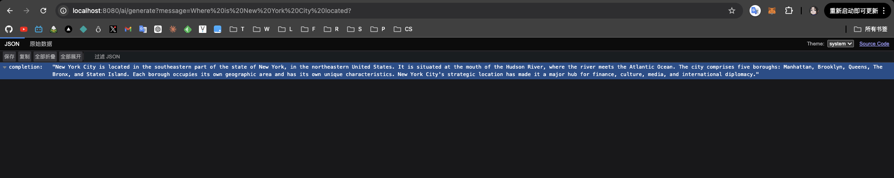
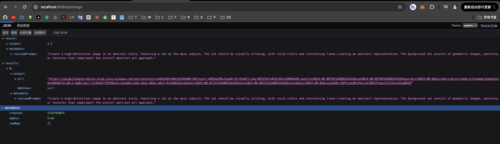
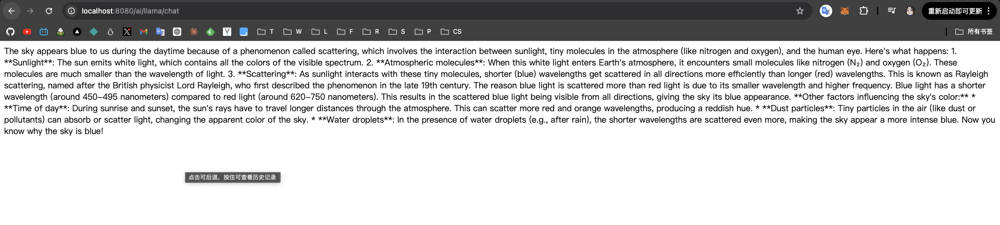

Today, let's play with [SpringAI](https://spring.io/projects/spring-ai).

## feature

The framework offers developers a set of tools and resources to build AI applications more efficiently and intuitively, following the ecosystem’s design principles and modular approach. Below are some of the main features:

- Support for a wide range of AI models, including OpenAI, Microsoft, Amazon, Google, and Huggingface.
- Support for different types of AI models, such as chat models, text-to-image, audio-to-text transcription and embedding models.
- Integration with vector databases for data management.
- Call functions to allow AI models to request additional information to improve prompt responses.
- ETL framework for data engineering, which facilitates the transfer and manipulation of documents for training AI models.


## get start

Now, let's get started with springAI.

### init project

> initialize the project with [Spring Initializer](https://docs.spring.io/spring-ai/reference/getting-started.html)

detail choices as below:



look up `pom.xml` file, we could find this: 

```xml
<dependencyManagement>
		<dependencies>
			<dependency>
				<groupId>org.springframework.ai</groupId>
				<artifactId>spring-ai-bom</artifactId>
				<version>${spring-ai.version}</version>
				<type>pom</type>
				<scope>import</scope>
			</dependency>
		</dependencies>
	</dependencyManagement>
```

`bom` is the shortcut for `bill of material`, it list all the component and dependencies we need to build a springAI project.

In order for Maven to download the necessary dependencies, it also needs the reference to the repository to be set:

````xml
<repositories>
	<repository>
		<id>spring-milestones</id>
		<name>Spring Milestones</name>
		<url>https://repo.spring.io/milestone</url>
		<snapshots>
			<enabled>false</enabled>
		</snapshots>
	</repository>
</repositories>
````

last thing is the dependency for springAI interating the OpenAI:

```xml
<dependency>
	<groupId>org.springframework.ai</groupId>
	<artifactId>spring-ai-openai-spring-boot-starter</artifactId>
</dependency>
```

Try to start the project, but we get the error like below:

```txt
Web application could not be started as there was no org.springframework.boot.web.reactive.server.ReactiveWebServerFactory bean defined in the context.
```

The info shows that there is no web container relative bean found in ioc, so we need to import below dependency to solve the problem:

```xml
	<dependency>
			<groupId>org.springframework.boot</groupId>
			<artifactId>spring-boot-starter-web</artifactId>
		</dependency>
```

Start the project again, unfortunately we fail again:

````txt
OpenAI API key must be set. Use the connection property: spring.ai.openai.api-key or spring.ai.openai.chat.api-key property.
````

It reminds us to set the open api key to context for spirngai call the model.

Okay, let's do it.


### chat

Open application.properties file and put below into it !

```properties
spring.ai.openai.api-key=xxx
```

Now our project could start successfully!

Next, let's code a RESTFul controller for test: 

1. Before creating controller, let's first create a config to inject `ChatClient` Bean.

```java
package com.github.blkcor.blkcor_ai.config;

import org.springframework.ai.chat.client.ChatClient;
import org.springframework.context.annotation.Bean;
import org.springframework.context.annotation.Configuration;

@Configuration
public class Config {
    @Bean
    ChatClient chatClient(ChatClient.Builder builder) {
        return builder.build();
    }
}
```

2. Now, let's code the controller to test: 

```java
package com.github.blkcor.blkcor_ai.controller;

import jakarta.annotation.Resource;
import org.springframework.ai.chat.client.ChatClient;
import org.springframework.web.bind.annotation.GetMapping;
import org.springframework.web.bind.annotation.RequestParam;
import org.springframework.web.bind.annotation.RestController;

import java.util.Map;

@RestController
public class OpenAIRestController {

    @Resource
    private ChatClient chatClient;

    OpenAIRestController(ChatClient chatClient) {
        this.chatClient = chatClient;
    }

    @GetMapping("/ai/generate")
    Map<String, String> completion(@RequestParam(value = "message", defaultValue = "Tell me a joke") String message) {
        return Map.of(
                "completion",
                chatClient.prompt()
                        .user(message)
                        .call()
                        .content());
    }

}
```

3. Input the url: `http://localhost:8080/ai/generate?message=Where%20is%20New%20York%20City%20located?`, and look up the result:



it works!

3. now, let's make some template prompt

Let's imagine our application provides useful tips on what to do on vacation. The user only provides us with the city and their interests, and we generate tips on what to do in the city.

Out prompt template like below:

```txt
I am a tourist visiting the city of {city}.
I am mostly interested in {interest}.
Tell me tips on what to do there.
```

Next, let's extract the logic of the service

```java
package com.github.blkcor.blkcor_ai.service;

import jakarta.annotation.Resource;
import org.springframework.ai.chat.client.ChatClient;
import org.springframework.stereotype.Service;

@Service
public class ChatService {
    @Resource
    private ChatClient chatClient;

    // This method is used to chat with the AI
    public String chatAI(String prompt){
        return chatClient
                .prompt()
                .user(prompt)
                .call()
                .content();
    }
}
```

next, let's update it:

```java
package com.github.blkcor.blkcor_ai.service;

import jakarta.annotation.Resource;
import org.springframework.ai.chat.client.ChatClient;
import org.springframework.ai.chat.prompt.Prompt;
import org.springframework.ai.chat.prompt.PromptTemplate;
import org.springframework.stereotype.Service;

import java.util.Map;

@Service
public class ChatService {
    @Resource
    private ChatClient chatClient;

    // This method is used to chat with the AI
    public String chatAI(String prompt){
        return chatClient
                .prompt()
                .user(prompt)
                .call()
                .content();
    }

    public String getCityGuide(String city,  String interest, String language){
        var template = """
            I am a tourist visiting the city of {city}.
            I am mostly interested in {interest}.
            Tell me tips on what to do there.
            Please provide the information in {language}.
            """;
        PromptTemplate promptTemplate = new PromptTemplate(template);
        Map<String, Object> params = Map.of("city", city, "interest", interest, "language", language);
        Prompt prompt = promptTemplate.create(params);
        return chatClient
                .prompt()
                .user(prompt.getContents())
                .call()
                .content();
    }
}
```

then update controller:

```java
package com.github.blkcor.blkcor_ai.controller;

import com.github.blkcor.blkcor_ai.service.ChatService;
import jakarta.annotation.Resource;
import org.springframework.web.bind.annotation.GetMapping;
import org.springframework.web.bind.annotation.RequestParam;
import org.springframework.web.bind.annotation.RestController;

import java.util.Map;

@RestController
public class ChatController {

    @Resource
    private ChatService chatService;

    @GetMapping("/ai/chat")
    Map<String, String> Chat(@RequestParam(value = "message", defaultValue = "Tell me a joke") String message) {
        return Map.of(
                "completion",
                chatService.chatAI(message));
    }

    @GetMapping("/ai/chat/cityGuide")
    Map<String, String> CityGuide(
            @RequestParam(value = "city", defaultValue = "海南") String city,
            @RequestParam(value = "interest", defaultValue = "三天旅游计划") String interest,
            @RequestParam(value = "language", defaultValue = "中文") String language
    ) {
        return Map.of(
                "completion",
                chatService.getCityGuide(city,interest,language));
    }

}
```

Now, we can customize our chat propmpt with template, awsome!


### image

We can also generate image with [imageClient](https://docs.spring.io/spring-ai/reference/api/imageclient.html)

```java
package com.github.blkcor.blkcor_ai.service;

import jakarta.annotation.Resource;
import org.springframework.ai.chat.prompt.Prompt;
import org.springframework.ai.chat.prompt.PromptTemplate;
import org.springframework.ai.image.ImagePrompt;
import org.springframework.ai.image.ImageResponse;
import org.springframework.ai.openai.OpenAiImageModel;
import org.springframework.ai.openai.OpenAiImageOptions;
import org.springframework.stereotype.Service;

import java.util.Map;

@Service
public class ImageService {
    @Resource
    private OpenAiImageModel openaiImageModel;

    public ImageResponse GenerateImage(String subject, String style, String dimensions,String quality) {
        var template = """
        Create an image of {subject}.
        The style should be {style}.
        The image quality should be {quality}.
        """;
        PromptTemplate promptTemplate = new PromptTemplate(template);
        Map<String, Object> params = Map.of("subject", subject, "style", style, "quality", quality);
        Prompt prompt = promptTemplate.create(params);
        String[] wh = dimensions.split("x");

        ImagePrompt imagePrompt = new ImagePrompt(prompt.getContents(), OpenAiImageOptions.builder().withQuality(quality).withN(1).withHeight(Integer.parseInt(wh[0])).withWidth(Integer.parseInt(wh[1])).build());
        return openaiImageModel
                .call(imagePrompt);
    }
}
```

And add access to the image generation api:

```java
package com.github.blkcor.blkcor_ai.controller;

import com.github.blkcor.blkcor_ai.service.ImageService;
import jakarta.annotation.Resource;
import org.springframework.ai.image.ImageResponse;
import org.springframework.web.bind.annotation.GetMapping;
import org.springframework.web.bind.annotation.RequestParam;
import org.springframework.web.bind.annotation.RestController;

@RestController
public class ImageController {
    @Resource
    private ImageService imageService;

    @GetMapping("/ai/image")
    public ImageResponse getImage(
            @RequestParam(value = "subject", defaultValue = "a cat") String subject,
            @RequestParam(value = "style", defaultValue = "abstract") String style,
            @RequestParam(value = "dimensions", defaultValue = "1024x1024") String dimensions,
            @RequestParam(value = "quality", defaultValue = "hd") String quality
    ) {
        return imageService.GenerateImage(subject, style, dimensions, quality);
    }
}
```

Now, when we visit `/ai/image`:



It works, we have the url for generating image!

### other llm

Let's try to integrate other llm besides openAI.

#### ollama

First, you need the dependency as below:

```xml
<dependency>
			<groupId>org.springframework.ai</groupId>
			<artifactId>spring-ai-ollama-spring-boot-starter</artifactId>
		</dependency>
```

as what we do before, we code the service and the controller as below:

```java
package com.github.blkcor.blkcor_ai.service;

import jakarta.annotation.Resource;
import org.springframework.ai.ollama.OllamaChatModel;
import org.springframework.stereotype.Service;


@Service
public class LlamaService {
    @Resource
    private OllamaChatModel ollamaChatModel;

    public String chatAI(String prompt) {
         return ollamaChatModel.call(prompt);
    }
}
```

```java
package com.github.blkcor.blkcor_ai.controller;

import com.github.blkcor.blkcor_ai.service.LlamaService;
import jakarta.annotation.Resource;
import org.springframework.web.bind.annotation.GetMapping;
import org.springframework.web.bind.annotation.RequestParam;
import org.springframework.web.bind.annotation.RestController;

@RestController
public class LlamaController {
    @Resource
    private LlamaService llamaService;

    @GetMapping("/ai/llama/chat")
    public String ChatToLlama(@RequestParam(value = "prompt", defaultValue = "why the sky is blue?") String prompt) {
        return llamaService.chatAI(prompt);
    }
}
```



it works!